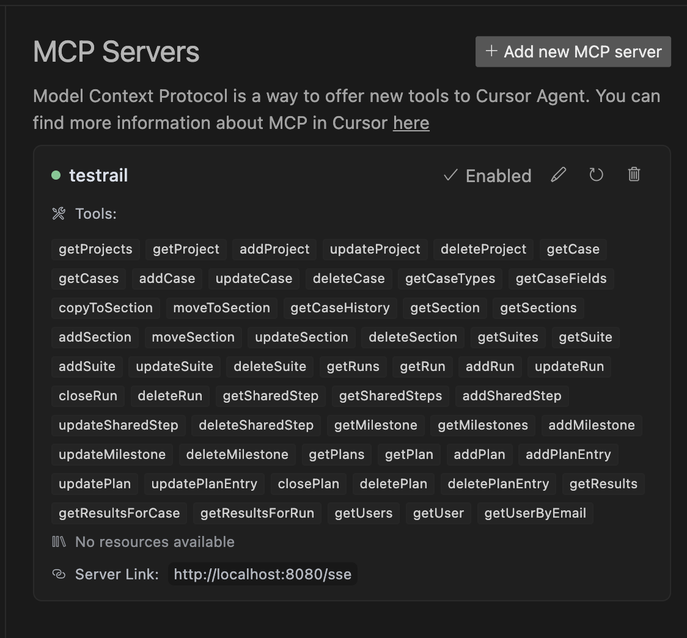
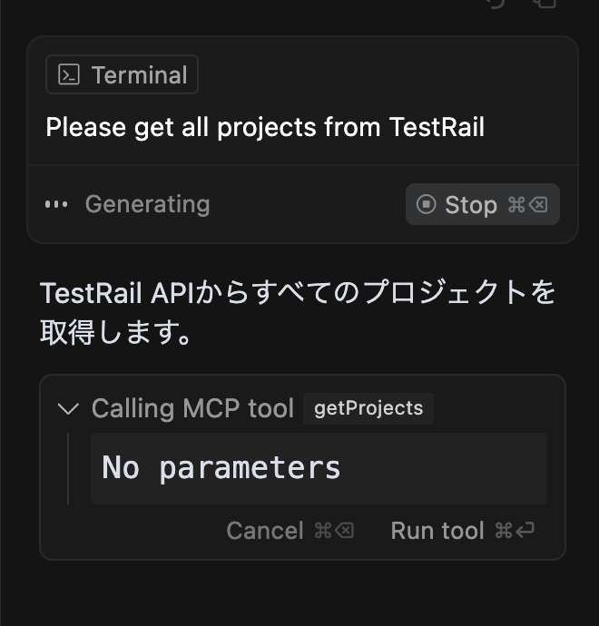
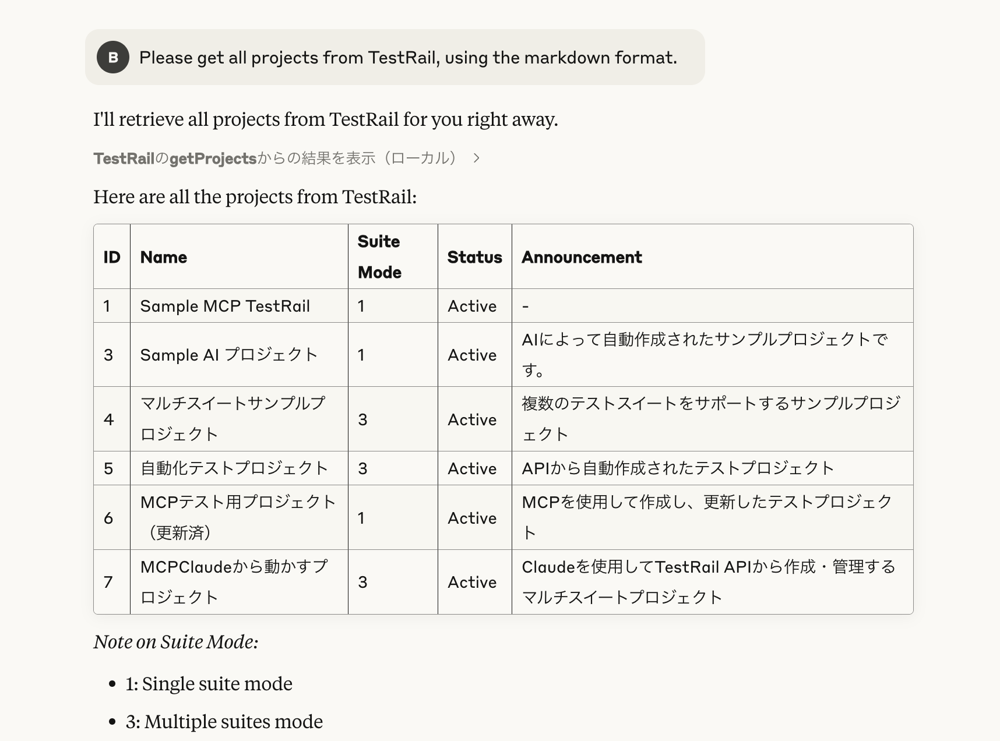

# TestRail MCP Server

This Model Context Protocol (MCP) server provides tools for interacting with TestRail directly from Claude AI and other MCP-supported clients like Cursor. It allows you to manage test cases, projects, suites, runs, and more without leaving your conversation with the AI.

## Available Tools

The TestRail MCP server provides the following tools:

| Category | Tools |
|----------|-------|
| **Projects** | `getProjects`, `getProject`, `addProject`, `updateProject`, `deleteProject` |
| **Cases** | `getCase`, `getCases`, `addCase`, `updateCase`, `deleteCase`, `getCaseTypes`, `getCaseFields` |
| **Sections** | `getSection`, `getSections`, `addSection`, `moveSection`, `updateSection`, `deleteSection`, `copyToSection`, `moveToSection`, `getCaseHistory` |
| **Suites** | `getSuites`, `getSuite`, `addSuite`, `updateSuite`, `deleteSuite` |
| **Runs** | `getRuns`, `getRun`, `addRun`, `updateRun`, `closeRun`, `deleteRun` |
| **Shared Steps** | `getSharedStep`, `getSharedSteps`, `addSharedStep`, `updateSharedStep`, `deleteSharedStep` |
| **Milestones** | `getMilestone`, `getMilestones`, `addMilestone`, `updateMilestone`, `deleteMilestone` |
| **Plans** | `getPlans`, `getPlan`, `addPlan`, `addPlanEntry`, `updatePlan`, `updatePlanEntry`, `closePlan`, `deletePlan`, `deletePlanEntry` |
| **Results** | `getResults`, `getResultsForCase`, `getResultsForRun` |
| **Users** | `getUsers`, `getUser`, `getUserByEmail` |

## Usage

### Setting up in Cursor with Claude

To use the TestRail MCP server in Cursor with Claude:

1. Start the server locally with `npm run start`
  - Please run `npm run install` and `npm run build`, before you execute the command
  - Please set up your .env based on the .env.example file as a reference.
2. The server will run on `http://localhost:8080/sse`
3. In Cursor, navigate to the MCP Servers section and add the TestRail server

4. Configure with the following details:
   - **Name**: TestRail
   - **Server Link**: http://localhost:8080/sse
   - **Connection Type**: SSE

Once connected, you'll see all the available tools as shown in the image above.

### Calling Tools from MCP Clients

When using an MCP-supported client like Claude in Cursor, you can call the TestRail MCP tools directly during your conversation. For each tool, you'll need to provide the appropriate parameters as defined in the TestRail API.

From Cursor:

From Claude Desktop:

## Troubleshooting

- **`spawn node ENOENT` errors**: Ensure that Node.js is properly installed and in your PATH.
- **Connection issues**: Verify that the server is running and the URL is correctly configured in your MCP client.
- **Authentication issues**: Check your TestRail API credentials in the `.env` file.
- **SSE connection errors**: If you see `SSE error: TypeError: fetch failed: connect ECONNREFUSED`, make sure the server is running on the specified port.

## Contributing

Contributions are welcome! Please feel free to submit a Pull Request.

## Acknowledgements

- [TestRail API](https://docs.testrail.techmatrix.jp/testrail/docs/702/api/)
- [Model Context Protocol SDK](https://github.com/modelcontextprotocol/typescript-sdk)

